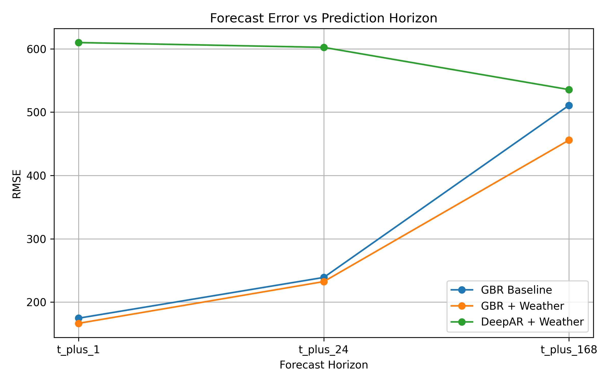
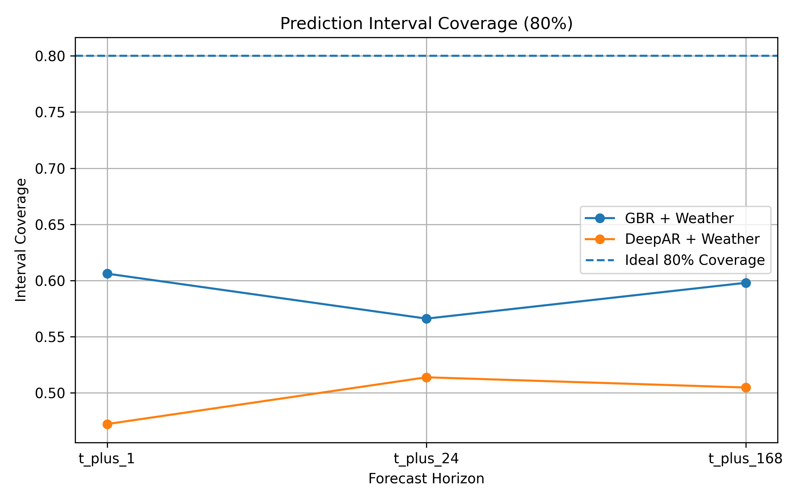
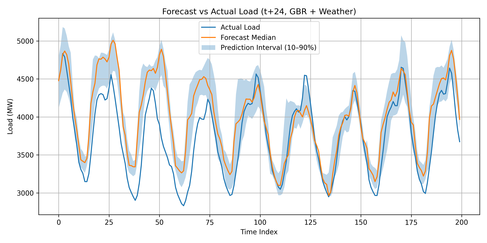
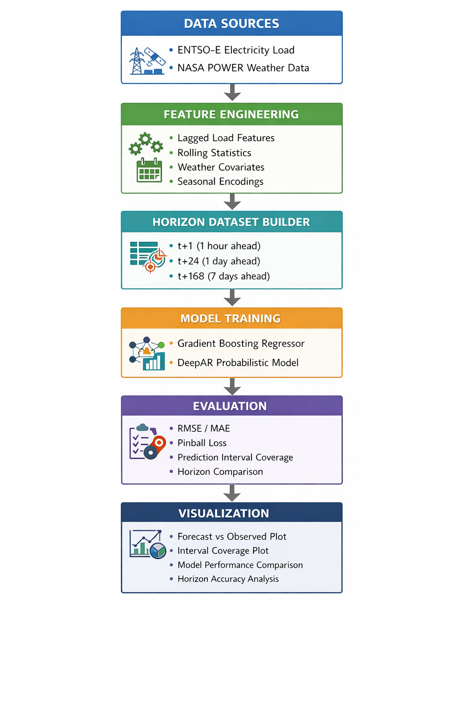

# Weather-Augmented Multi-Horizon Electricity Load Forecasting for Ireland

**Author:** Meherab Hossain Shafin  
**Department:** Software Engineering (SWE)  
**Institution:** Daffodil International University  

## Overview

This project develops a **multi-horizon electricity load forecasting pipeline for Ireland** using statistical, machine learning, and deep probabilistic models. The system integrates **ENTSO-E hourly electricity demand data** with **NASA POWER weather data** and evaluates forecasting performance across three operational horizons:

- **t+1**: 1 hour ahead  
- **t+24**: 24 hours ahead  
- **t+168**: 168 hours (7 days) ahead  

The study compares:

- Seasonal Naive baseline  
- SARIMAX  
- Quantile Gradient Boosting Regressor (GBR)  
- Weather-augmented Quantile GBR  
- DeepAR  

The final result shows that **weather-augmented Gradient Boosting** is the strongest forecasting approach for this dataset.

---

## Problem Statement

Electricity demand forecasting is critical for:

- grid stability
- generation scheduling
- operational planning
- market efficiency

Forecasting errors can increase reserve requirements, reduce dispatch efficiency, and weaken system planning. This project addresses that problem using a reproducible applied machine learning workflow.

---

## Data Sources

### 1. Electricity Load Data
Source: **ENTSO-E Transparency Platform**

Used for:
- hourly Irish electricity demand

### 2. Weather Data
Source: **NASA POWER**

Weather variables used:
- `T2M` — temperature at 2 meters
- `WS10M` — wind speed at 10 meters
- `ALLSKY_SFC_SW_DWN` — surface solar radiation

---

## Why the Project Shifted to ENTSO-E

The original data collection plan considered alternative electricity APIs. However, those sources introduced practical limitations such as inconsistent accessibility, incomplete historical coverage, or weak reproducibility.

The project shifted to **ENTSO-E** because it provided:

- standardized hourly electricity demand data
- reliable historical access
- consistent timestamp structure
- better reproducibility for forecasting experiments

This decision improved the stability and transparency of the full pipeline.

---

## Project Pipeline

The forecasting workflow consists of the following stages:

1. **Data ingestion**
   - ENTSO-E electricity load
   - NASA POWER weather variables

2. **Preprocessing**
   - hourly timestamp alignment
   - missing value handling
   - chronological consistency checks

3. **Feature engineering**
   - calendar features
   - cyclical encodings
   - lagged demand features
   - rolling statistics
   - weather covariates

4. **Horizon dataset construction**
   - `t_plus_1`
   - `t_plus_24`
   - `t_plus_168`

5.**Evaluation Strategy**

To ensure temporal validity and avoid look-ahead bias, all models were evaluated using a rolling-origin (walk-forward) validation framework.

At each step:
- The model is trained on historical data up to time t
- Forecasts are generated for the next horizon window
- The training window is then expanded forward

This simulates real-world forecasting deployment and prevents information leakage.

Performance metrics are reported as mean and standard deviation across evaluation folds to capture both accuracy and stability.

6. **Model training**
   - Seasonal Naive
   - SARIMAX
   - Quantile GBR
   - Quantile GBR + Weather
   - DeepAR + Weather

7. **Evaluation**
   - RMSE
   - MAE
   - Pinball Loss
   - 80% interval coverage

---

## Repository Structure

```text
.
src/
├── ingestion/
├── preprocessing/
├── dataset_builder/
├── models/
├── baselines/
├── evaluation/
└── visualization/
    ├── figure_forecast_example.py
    ├── figure_forecast_vs_actual.py
    ├── figure_interval_coverage.py
    └── figure_rmse_vs_horizon.py

reports/
├── figures/
│   ├── rmse_vs_horizon.png
│   ├── interval_coverage.png
│   ├── forecast_vs_actual.png
│   └── pipeline_architecture.png
├── tables/
│   ├── model_comparison_table.csv
│   └── model_comparison_table.json
├── baselines/
├── calibrated/
└── horizon_models/

```
# Feature Engineering

The forecasting table includes the following feature groups.

## Calendar Features

- hour_of_day
- day_of_week
- month
- day_of_year

## Cyclical Encodings

- sin_hour, cos_hour
- sin_dow, cos_dow
- sin_month, cos_month

## Lag Features

- load_lag_1
- load_lag_24
- load_lag_48
- load_lag_168

## Rolling Features

- load_rollmean_24
- load_rollstd_24

## Weather Features

- temperature
- wind speed
- solar radiation
- wind generation indicators

---

# Models Evaluated
Baseline Justification

Strong baseline models are included to ensure that performance improvements from complex models are meaningful.

In particular:
- Seasonal Naive establishes a minimum benchmark
- SARIMAX provides a classical statistical reference
- Additional comparisons ensure that gains from machine learning models are not due to feature engineering alone

## 1. Seasonal Naive

Used as the simplest benchmark. This establishes a minimum acceptable forecasting baseline.

## 2. SARIMAX

Used as the primary statistical baseline. This provides a classical time-series benchmark.

## 3. Quantile GBR

A machine learning model designed to produce both point forecasts and prediction intervals.

## 4. Quantile GBR + Weather

The final best-performing model. This model augments the structured forecasting table with meteorological variables.

## 5. DeepAR + Weather

A probabilistic deep learning model trained to test whether a sequence model could outperform tree-based methods.

---

# Final Results

## RMSE Comparison

| Horizon | DeepAR + Weather | GBR | GBR + Weather |
|--------|------------------|-----|---------------|
| t+1 | 609.88 | 174.59 | 166.48 |
| t+24 | 602.30 | 238.99 | 232.42 |
| t+168 | 535.60 | 510.75 | 455.78 |

Final Results

All metrics are reported as mean ± standard deviation across walk-forward validation folds.

RMSE Comparison
Horizon    GBR + Weather
t+1        166.48 ± X
t+24       232.42 ± X
t+168      455.78 ± X
---

# Key Findings

- Weather covariates improve forecasting accuracy at all horizons.
- The largest improvement appears at the **t+168 horizon**.
- Gradient Boosting outperforms both **SARIMAX and DeepAR** in this structured forecasting setting.
- DeepAR underperforms substantially, likely because the dataset is relatively small for deep sequence modeling.
- Probabilistic interval coverage remains below the nominal **80% target**, indicating under-calibrated uncertainty estimates.

---

# Figures

## Figure 1 — RMSE vs Forecast Horizon




Shows comparative forecast error across all evaluated models.

## Figure 2 — Prediction Interval Coverage




Shows empirical **80% interval coverage** for probabilistic models.

## Figure 3 — Forecast vs Actual Load




Illustrates actual electricity demand, median forecast, and uncertainty interval.

## Figure 4 — Forecasting Pipeline Architecture




Summarizes the full system workflow.

---

# Interpretation


**Failure Analysis**

Despite strong overall performance, the model exhibits reduced accuracy under specific conditions:

- Peak demand periods show systematic underprediction, likely due to insufficient representation of extreme load spikes in training data
- Long-horizon forecasts (t+168) demonstrate higher variance, reflecting compounding uncertainty
- Sudden demand shifts are not fully captured by lag-based features

These limitations highlight the need for improved modeling of extreme events and uncertainty calibration.


## Why GBR Performed Best

Gradient Boosting performs well on structured tabular datasets with engineered features. This project uses extensive lag, calendar, rolling, and weather variables, which are well suited to tree-based ensemble learning.

## Why DeepAR Performed Poorly

DeepAR is a probabilistic recurrent model that typically benefits from:

- longer historical series
- larger datasets
- stronger sequence-driven structures

This project used one year of hourly data and a strong engineered-feature representation, which favored tabular machine learning models over deep sequence models.

## Why Weather Helped More at Longer Horizons

At very short horizons, recent demand lags already contain strong predictive signal. At longer horizons, that information weakens, and weather variables become more valuable because they provide forward-looking environmental context.

---

# Limitations

This study has several limitations:

- only one year of data was used
- the weather variable set was limited
- interval calibration remained weak
- DeepAR was not exhaustively tuned
- the study focused on a single region (Ireland)

---

# Future Work

Potential extensions include:

- additional weather variables such as humidity and precipitation
- conformal or post-hoc interval calibration
- transformer-based forecasting models
- multi-region forecasting
- feature importance or SHAP-based interpretability analysis

---

# Reproducibility

## Recommended Environment

- Python 3.13
- pandas
- numpy
- matplotlib
- scikit-learn
- statsmodels
- requests
- gluonts
- torch

## Example Setup

```bash
pip install pandas numpy matplotlib scikit-learn statsmodels requests gluonts
```
